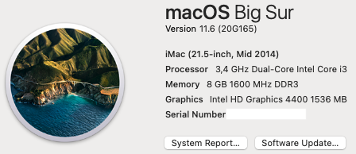
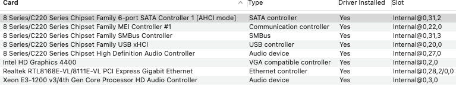
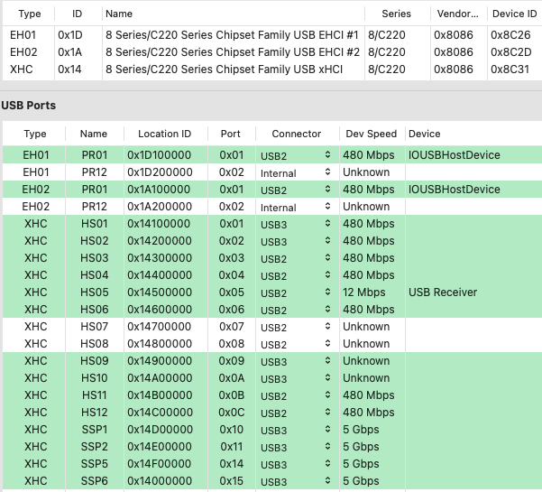
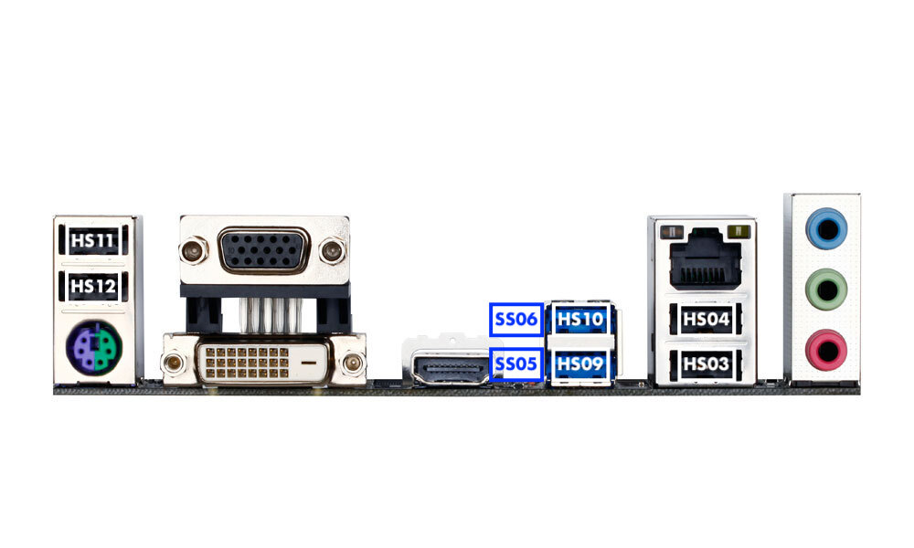
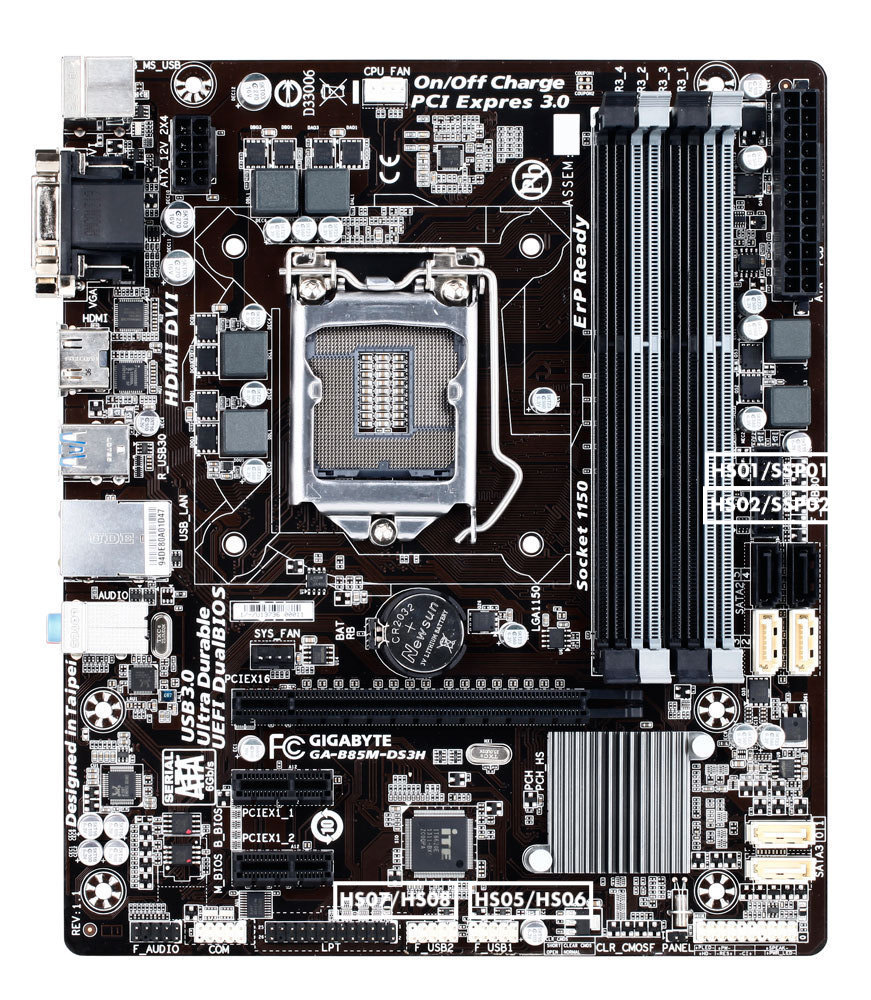

# Gigabyte-B85M-DS3H-i3-4130
 

  
 

 

  
 

## Specs
 | **Component** | **Model** |
| ------------- | --------- |
| CPU | i3-4130 |
| RAM | DDR3 8GB (2x4GB) 1600MHz |
| Audio Chipset | Realtek ALC887. Works with layout id 1 |
| iGPU | Intel HD Graphics 4400. Works with device-id swap |
| Lan |  Realtek 1GbE LAN. |
| OS Disk | 128GB Samsung 850 Pro SATA |
| macOS | Big Sur 11.6/OpenCore 0.7.4 |

## USB
I have made a custom USB-B85M-DS3H.kext that should be used together with XhciPortLimit kernel quirk. All ports are working
 

  
 

 

  
 

 

  
 

 